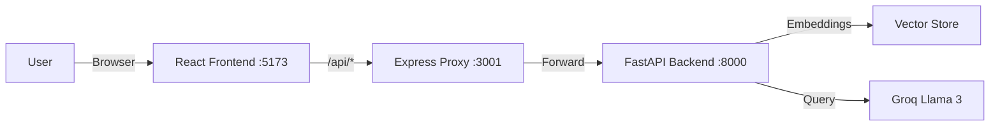

<<<<<<< HEAD
# PDF Chatbot

## Overview
A full-stack application that allows users to upload PDF documents and ask questions about their content using AI. This project leverages a Retrieval-Augmented Generation (RAG) pipeline to provide accurate answers based *only* on the uploaded document.

## Architecture
The application follows a modern 3-layer architecture:

1.  **Frontend (React + Vite)**: A responsive, dark-themed user interface for uploading PDFs and chatting.
    *   *Port: 5173*
2.  **Proxy Server (Express)**: A lightweight Node.js middleware to handle API requests and simplify CORS.
    *   *Port: 3001*
3.  **Backend (FastAPI)**: The core Python API that processes PDFs, manages embeddings, and interacts with the LLM.
    *   *Port: 8000*



## Workflow & Logic

### 1. Frontend (React)
Located in `frontend/src`.
-   **Tech Stack**: React 18, Vite, Lucide React (Icons), Framer Motion (Animations), Axios.
-   **Key Components**:
    -   `App.jsx`: The main controller. It manages the global state (`sessionId`, `messages`, `file`) and handles high-level error catching (e.g., handling 404s on session delete).
    -   `Sidebar.jsx`: Handles file uploads via drag-and-drop. It displays the active session info and provides "Get Summary" and "Delete Session" actions.
    -   `ChatArea.jsx`: Displays the chat history. It distinguishes between user and AI messages and handles the typing indicator state.
-   **Connectivity**: `api.js` creates an Axios instance pointing to `/api`, which is configured in `vite.config.js` to proxy to the Express server.

### 2. Proxy Server (Express)
Located in `frontend/server.js`.
-   **Purpose**: To serve as a consistent API gateway and avoid Cross-Origin Resource Sharing (CORS) complexities during development.
-   **Function**: It uses `http-proxy-middleware` to forward all requests matching `/api/*` to the FastAPI backend at `http://localhost:8000`.

### 3. Backend (FastAPI + LangChain)
Located in the root directory.
-   **Tech Stack**: Python 3.10+, FastAPI, LangChain, FAISS (Vector DB), Groq (Llama 3.3 70B).
-   **Core Modules**:
    -   `pdf_loader.py`: Uses `pypdf` to extract raw text from uploaded PDF files.
    -   `text_splitter.py`: Splits the raw text into manageable chunks (e.g., 1000 characters) with overlap to preserve context.
    -   `embeddings.py`: Converts text chunks into vector embeddings using HuggingFace models (`sentence-transformers/all-MiniLM-L6-v2`) and stores them in a FAISS index.
    -   `llm.py`: Initializes the ultra-fast Groq LLM (Llama 3.3 70B) using the API key from `.env`.
    -   `qa_chain.py`: Creates a LangChain RetrievalQA chain. This chain takes a user's question, finds relevant chunks from FAISS, and sends them to the LLM to generate an answer.
    -   `api.py`: The FastAPI application that exposes REST endpoints:
        -   `POST /upload`: accepts a PDF, processes it, and returns a `session_id`.
        -   `POST /ask`: accepts a `session_id` and question, returning the AI's answer.
        -   `GET /summary/{id}`: generates a document summary.
        -   `DELETE /session/{id}`: clears the session and frees memory.

## Detailed Step-by-Step Workflow

### Scenario 1: Uploading a PDF
1.  **User Action**: User drags and drops a PDF file into the `Sidebar` component.
2.  **Frontend (React)**:
    *   The `onDrop` event handler captures the file.
    *   `App.jsx` calls `uploadPDF(file)` from `api.js`.
    *   Axios sends a `POST` request to `http://localhost:5173/api/upload` with the file as `FormData`.
3.  **Proxy (Express)**:
    *   Intercepts the request because it starts with `/api`.
    *   Rewrites the path to `/upload` and forwards it to the backend at `http://localhost:8000/upload`.
4.  **Backend (FastAPI)**:
    *   Receives the `UploadFile`.
    *   **Processing**:
        1.  Saves the file to a temporary location on disk.
        2.  `pdf_loader` extracts raw text from the PDF.
        3.  `text_splitter` chunks the text (e.g., 1000 chars) for the LLM.
        4.  `embeddings` converts chunks into vector representations using HuggingFace.
        5.  `text_splitter` stores these vectors in a FAISS index (in-memory).
        6.  Creates a LangChain `RetrievalQA` chain connected to the Groq LLM.
        7.  Generates a unique `session_id` (UUID).
        8.  Stores the QA chain in the global `sessions` dictionary: `sessions[session_id] = qa_chain`.
    *   **Response**: Returns JSON `{ "session_id": "...", "filename": "...", "message": "..." }`.
5.  **Completion**:
    *   React receives the `session_id`.
    *   `App.jsx` updates state, hiding the upload zone and showing the "Active Session" card.

### Scenario 2: Asking a Question
1.  **User Action**: User types a question in `ChatArea` and hits "Send".
2.  **Frontend (React)**:
    *   `App.jsx` immediately adds the user's message to the `messages` state (optimistic UI).
    *   Calls `askQuestion(sessionId, question)` from `api.js`.
    *   Axios sends `POST /api/ask` with JSON `{ "session_id": "...", "question": "..." }`.
3.  **Proxy (Express)**:
    *   Forwards request to `http://localhost:8000/ask`.
4.  **Backend (FastAPI)**:
    *   Lookups the session: `chain = sessions.get(session_id)`.
    *   **RAG Pipeline**:
        1.  `chain.invoke(question)` is called.
        2.  **Retrieval**: FAISS finds the top 3-4 text chunks most relevant to the question.
        3.  **Generation**: Constructs a prompt containing the question + retrieved text chunks.
        4.  **Inference**: Sends prompt to Groq (Llama 3.3).
    *   **Response**: Returns JSON `{ "answer": "The document says..." }`.
5.  **Completion**:
    *   React receives the answer.
    *   `App.jsx` adds the AI's response to the chat history.

### Scenario 3: Deleting a Session
1.  **User Action**: User clicks "Delete Session" in the sidebar.
2.  **Frontend**:
    *   Calls `deleteSession(sessionId)`.
    *   Sends `DELETE /api/session/{id}`.
3.  **Backend**:
    *   Removes `session_id` from the `sessions` dictionary, freeing memory.
    *   Returns success message.
4.  **Completion**:
    *   React clears `sessionId`, `file`, and `messages` from state.
    *   UI reverts to the "Upload PDF" screen.


## Setup & Running

### Prerequisites
-   Node.js (v18 or higher)
-   Python (v3.10 or higher)
-   Groq API Key (set in `.env` as `GROQ_API_KEY`)

### Steps

1.  **Start Backend** (Terminal 1)
    ```powershell
    cd d:\pdf_chatbot
    venv\Scripts\activate
    uvicorn api:app --reload --port 8000
    ```

2.  **Start Frontend Proxy & UI** (Terminal 2)
    ```powershell
    cd d:\pdf_chatbot\frontend
    # Starts both Express proxy and Vite dev server
    npm run server  
    npm run dev     
    ```
    *(Note: You might need two separate terminals for the frontend if `npm run dev` blocks)*

3.  **Access Application**
    Open your browser to `http://localhost:5173`.
=======
# mindvault
This is my personal project based on rag model 
>>>>>>> e1c617ed68cb8d3d165118cf9a184f63f4bacfdd
